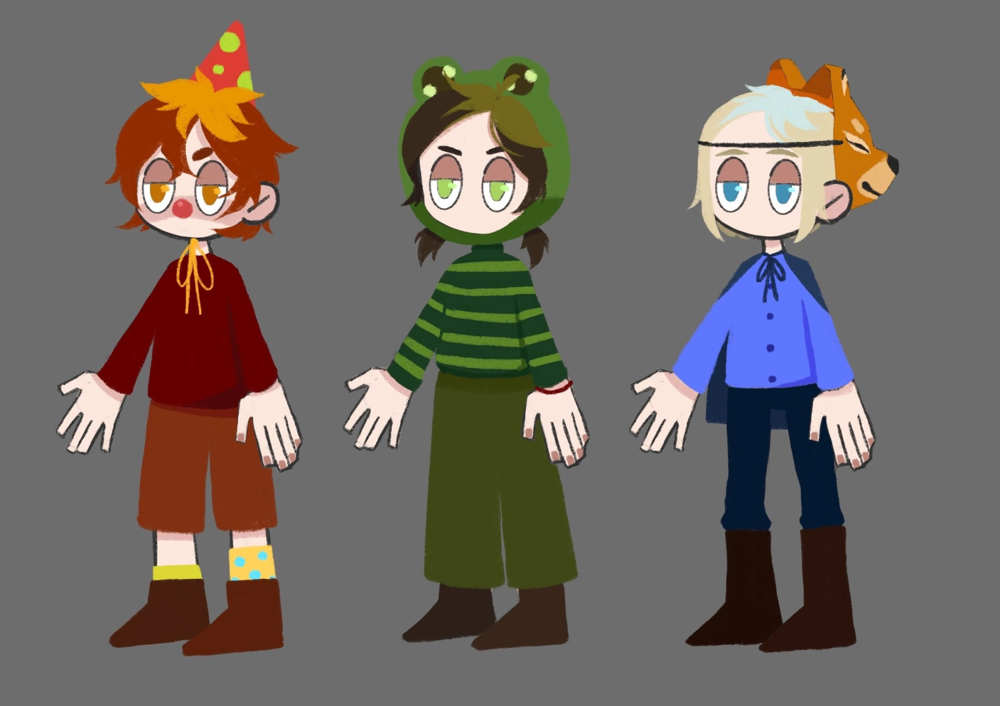
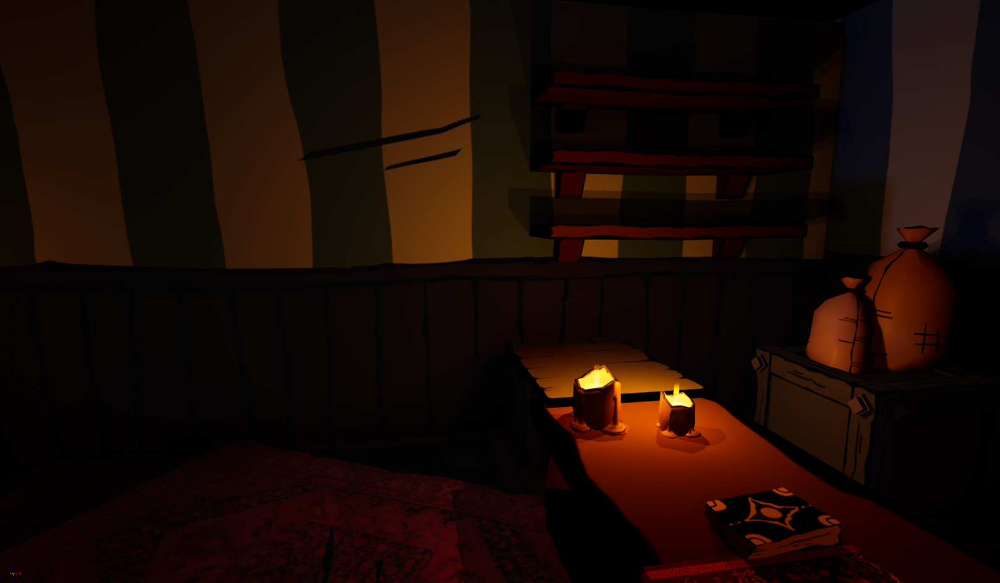

<h1>Hello, I'm Mariia Medvedeva!
  
<h2>📺 2020-2023 video works</h2>

- <b>2020</b>
  - [Rat with Hat](https://youtu.be/D2fg5JMnKQk)
  - [The brew](https://youtu.be/KSIyWc0o8HI)
  
- <b>2021</b>
  - [Chertila(The imp)](https://youtu.be/KIsBe1wb6Ng)
  
- <b>2022</b>
  - [The Sun made of Glass](https://youtu.be/K-L07cAw2sM)
  
- <b>2023</b>
  - [Last Lament](https://youtu.be/vpy1gNMkN_0)

<h2>Rat with Hat</h2>

<b>This project was the first attempt of 2D and 3D animation and modeling for me.<b> 

For 3D animation, it was decided to use simple models for animation to create a comical effect. Also, I used outline shader in Blender.

<h2>The brew</h2>

<b>It was the first platformer that I made in my first year at the university. This game was inspired by Japanese mythology which I have been studying for a long time.<b> 

<h2>Chertila (The imp)</h2>

<b>It was a group project in which I was an artist. I did the environment, 29 animations and concept art for the characters.<b> 

Initially, my team and I wanted to make a story about the ordinary life of a little trickster from khrushchevka. However, we decided 
to add Slavic mythology to the narrative, which I tried to display 
in the character design.

This game has a demo on [itch.io](https://fluris.itch.io/chertila)!

<h2>Childhood</h2>

<b>This project was conceived as the first creation of a 3D model of a person by me.<b> 

I created 3 concept art for the main character and chose the last one.

<h2>Sun Made of Glass</h2>

<b>This story is about a village in which eternal night has come, in which the environment plays an important role. It was created with both 3D and 2D.<b> 

The characters were supposed to convey a dark atmosphere, so I used sharp lines.

Having created such a style for the characters, I tried to transfer it to the environment using textures drawn in the same style.

<h2>Last Lament</h2>

<b>My thesis, in which concept art conveyed the atmosphere of a mysterious environment and locations convey a sense of painful physicality.<b> 

In the video, I showed the process of creating the final graphics for the location and it also has a game trailer with a story. Screenshots of locations and concept arts are presented below.

<h2>The door</h2>

<b>The character that was made in Blender for “The Door” horror game which is currently in development.<b> 
Little is known about this person, so local old men whisper about them.

<h2>Connect with me:</h2>

✉️ memedvedeva25@gmail.com

<!--
**joshmadakor1/joshmadakor1** is a ✨ _special_ ✨ repository because its `README.md` (this file) appears on your GitHub profile.

Here are some ideas to get you started:

- 🔭 I’m currently working on ...
- 🌱 I’m currently learning ...
- 👯 I’m looking to collaborate on ...
- 🤔 I’m looking for help with ...
- 💬 Ask me about ...
- 📫 How to reach me: ...
- 😄 Pronouns: ...
- ⚡ Fun fact: ...
-->
